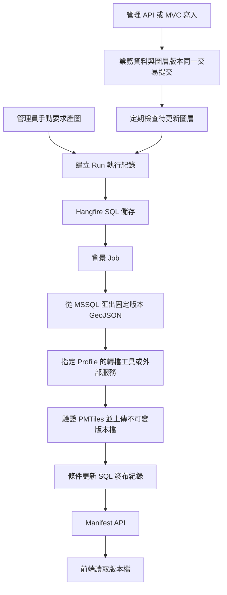

# Hangfire 分階段導入與 MSSQL → PMTiles 實作規劃

日期：2026-10-03。文件性質：實作前規劃；本次不安裝套件、不異動資料庫、不啟用排程。

閱讀本文需先理解 Controller、DTO、DI、EF Core 與 `SaveChangesAsync`；本文接著說明背景任務的排程、執行紀錄、重試與發布流程。「現況」表示已查閱程式；「建議」表示待實作設計；「待確認」表示仍需實際環境或業務決策。文中的新 API、類別與資料表均為建議名稱。

## 1. 建議方向與名詞

先以現有 ASP.NET Core 專案接入 Hangfire 與 SQL Server 儲存，驗證任務可排入、執行、查詢與重試。接著以 trails 完成單一圖層的全量產製，再擴充 indicators、disasteralerts。三個圖層分開產檔與發布，避免一個圖層失敗阻擋其他圖層。

Hangfire 負責排程與呼叫 .NET 方法；真正的 MSSQL 讀取、GeoJSON 匯出、PMTiles 轉換、檔案驗證及發布，仍須由專案實作。不得將「Hangfire 任務成功」直接等同「地圖已更新」。

| 名詞 | 本文件的意思 |
| --- | --- |
| Job／背景任務 | HTTP 回應後，由背景處理程序執行的工作 |
| Hangfire Client | 將任務寫入 Hangfire 儲存的程式 |
| Hangfire Server | 從佇列取得任務並執行的背景處理程序，不代表一定是另一台機器 |
| Worker | Server 中執行任務的工作單位；正式產圖預設先限制為 1 個 |
| Profile／工作設定 | 伺服器核准的匯出規則、工具版本、圖層名稱及輸出限制 |
| Run／執行紀錄 | 一次業務上的產圖請求；有自己的 RunId，與 Hangfire JobId 分開 |
| 冪等 | 同一個 Run 重複執行，不會重複發布或破壞已發布版本 |
| Manifest／圖層目錄 | 前端取得目前版本、下載網址與更新時間的 JSON 回應 |
| 發布 | 驗證完檔案後，讓圖層目錄指向新版本；單純產出檔案不算發布 |

使用者提到的 `trails/indicator/disastoralert`，在本專案對應 `/api/trails`、`/api/indicators`、`/api/disasteralerts`。下文統一使用 `trails`、`indicators`、`disasteralerts` 作為 DatasetKey，不新增拼錯的 API 別名。

## 2. 已確認的專案現況

| 查閱位置 | 現況與導入影響 |
| --- | --- |
| [prjGoHike.csproj](../prjGoHike.csproj) | 使用 .NET 10、EF Core SQL Server、NetTopologySuite；未宣告 Hangfire 套件 |
| [Program.cs](../Program.cs) | 已有 DbContext DI、JWT Bearer、角色授權、GeoJSON converter、HttpClient 使用案例；尚無 Hangfire 註冊 |
| [GoHikeDataContext.cs](../Models/GoHikeDataContext.cs) | `OnConfiguring` 已啟用 `UseNetTopologySuite()`；不能因 Program.cs 未寫此呼叫就判定未支援空間資料 |
| [TrailsApiController.cs](../APIControllers/GoHikeSafe/TrailsApiController.cs) | 公開讀取依 `IsPublished`；管理寫入使用 Admin 角色；主表與 TrailSegments 共同儲存 |
| [IndicatorApiController.cs](../APIControllers/GoHikeSafe/IndicatorApiController.cs) | 公開讀取依 `IsActive`；空間資料在 IndicatorSegments |
| [DisasterAlertsApiController.cs](../APIControllers/GoHikeSafe/DisasterAlertsApiController.cs) | 公開讀取只依 `IsActive`，目前未依 `EffectiveFrom`／`EffectiveTo` 排除未開始或已到期資料 |
| [AdminTrailsController.cs](../Controllers/AdminTrailsController.cs)、[AdminIndicatorController.cs](../Controllers/AdminIndicatorController.cs)、[AdminDisAlertController.cs](../Controllers/AdminDisAlertController.cs) | MVC 管理入口也會寫入同一批資料；自動觸發不能只接 API Controller |
| [GeoJsonGeometryConverter.cs](../Services/GeoJsonGeometryConverter.cs)、[GeoJsonGeometryValidator.cs](../Services/GeoJsonGeometryValidator.cs) | 已有 WGS84、座標範圍、幾何驗證；匯出可重用適合的規則，但仍須檢查歷史資料 |
| [資料庫快照](../DatabaseScripts/20260930_dbsnapshot_gohikesave.sql) | 三種 Segment 的 `Shape` 是 `sys.geography`；警示起訖時間是 `datetime2(0)`，不包含時區 |
| [Dockerfile](../../Dockerfile) | 目前只建置與啟動 Web 應用程式，未安裝 Tippecanoe 或其他轉檔工具 |
| [GoHikeSafeApiTests](../../tests/GoHikeSafeApiTests/Program.cs) | 有路由、JWT、DTO、GeoJSON 測試，但使用資料庫替身，不能證明 SQL 鎖定或交易正確 |

本次查閱範圍內未找到現成 MSSQL → PMTiles 腳本、Hangfire 整合或可沿用的 PMTiles 前端契約。上述 SQL 快照用於核對資料表與欄位定義，不等於已連線驗證的正式資料庫。

三個主表目前沒有可直接共用的資料版本欄位。不能假設已有 `UpdatedAt`，也不能用 `MAX(Id)` 判斷內容更新或刪除。

## 3. 責任與部署邊界



開發階段可在 Web 程序內啟動 Hangfire Server。正式產圖建議放在獨立、常駐的 Worker 程序或容器，避免轉檔佔用 Web 的 CPU、記憶體及磁碟。這是執行環境隔離，不需要因此建立微服務或重新分層整個專案。

Hangfire 的 ASP.NET Core 整合提供 DI 與背景處理服務；SQL Server 儲存需要額外設定。實作時選定並鎖住套件版本，於 .NET 10 與實際 SQL Server 上驗證，不從本文推定任意版本必然相容。[ASP.NET Core 整合文件](https://docs.hangfire.io/en/latest/getting-started/aspnet-core-applications.html)、[SQL Server 儲存文件](https://docs.hangfire.io/en/latest/configuration/using-sql-server.html)。

## 4. 分階段交付與停止條件

各階段通過驗收後再進入下一階段；不以「套件已安裝」作為功能完成標準。

| 階段 | 具體工作與交付 | 通過條件 | 未通過時的處理 |
| --- | --- | --- | --- |
| 0：盤點與契約 | 確認正式 SQL schema、資料量、SRID、部署 OS、檔案儲存位置、外部工具；確認第 6 節的匯出欄位與警示時間規則 | 三圖層各取得可用測試資料；決定 Profile、zoom、圖層名稱及更新時限 | 不開自動排程；先處理資料或環境缺口 |
| 1：Hangfire 基礎 | 加入 `Hangfire.AspNetCore`、`Hangfire.SqlServer`；Program.cs 註冊；增加設定開關與無副作用測試 Job | 任務排入後重啟應用仍可處理；有執行紀錄；未授權者不能查詢或操作管理介面 | 關閉 Server 與 Dashboard，保留既有 API |
| 2：trails 手動產製 | 完成 Run、Profile、匯出、CLI 執行、驗證與版本發布；新增管理 API 及 Manifest API | 一次真實資料端到端產圖成功；錯誤產物不發布；可回復前版；重複請求不重複發布 | 保留既有地圖來源；修正單一流程 |
| 3：三圖層與自動更新 | 加入 indicators、disasteralerts；接入 API、MVC 異動；持久化版本；合併短時間異動；警示起訖掃描 | 刪除、停用、改幾何、到期均可更新；資料提交後中斷仍可補排；同圖層不並行發布 | 關閉自動觸發，保留手動產製與錯誤查詢 |
| 4：正式部署與運維 | 獨立 Worker、資源限制、常駐監督、監控、檔案清理、部署回復演練 | 經重啟、重複投遞、儲存失敗、外部超時測試；滿足業務核定更新時限 | 停止新發布，回復已驗證版本；災害圖層依過期策略處理 |

### 階段 1 的設定要求

1. 增加 `Hangfire:Enabled`、`Hangfire:ServerEnabled`、`Hangfire:DashboardEnabled`。正式環境預設不公開 Dashboard。
2. 使用獨立 `ConnectionStrings:Hangfire` 設定；初期可共用 SQL Server instance，但使用獨立 Hangfire schema 或資料庫。開發／測試／正式環境各自隔離。
3. 區分安裝 schema 的部署權限與日常執行權限。先驗證官方 SQL 安裝腳本，再決定是否允許自動建表；不要把應用帳號設成資料庫擁有者。
4. Job 用建構式 DI 取得服務。任務參數只放 `RunId` 等小型識別值，不放 DbContext、Entity、HttpContext、JWT、連線字串或整份 GeoJSON。
5. 建議先設 `maintenance`、`tiles` 兩個佇列；正式轉檔由只監聽 `tiles` 的專用 Server 執行，該 Server 的 `WorkerCount` 先設 1。不要誤以為這會限制其他 Server 的 Worker 數。
6. Dashboard 若需啟用，必須加上實際驗證 Admin 身分的授權 filter。一般瀏覽器導覽不會自動帶 API 的 Bearer token；第一版可先關閉 Dashboard，以受保護的 Run API 操作。不可把 token 放網址，也不可只靠預設本機限制。[Dashboard 授權文件](https://docs.hangfire.io/en/latest/configuration/using-dashboard.html)。

## 5. 「指定外部任務」的明確契約

### 5.1 管理員能指定什麼

管理員選擇 DatasetKey 與伺服器已登錄的 ProfileKey，例如 `trails-v1`。Profile 控制資料查詢、工具及輸出；不得讓管理員提交 shell 指令、SQL、可執行檔路徑、任意遠端網址或輸出路徑。即使呼叫者是 Admin，也只允許執行已部署的工作設定。

| ProfileKey 範例 | DatasetKey | 來源 | PMTiles source-layer 建議 |
| --- | --- | --- | --- |
| `trails-v1` | `trails` | Trails + TrailSegments | `trails` |
| `indicators-v1` | `indicators` | Indicators + IndicatorSegments | `indicators` |
| `disasteralerts-v1` | `disasteralerts` | DisasterAlerts + AlertSegments | `disasteralerts` |

每個 Profile 至少包含：版本、允許的 DatasetKey、執行方式、固定工具版本、匯出欄位、幾何規則、min/max zoom、timeout、工作目錄根路徑、檔案大小限制、目的儲存區。秘密值另外由部署環境注入。

### 5.2 執行方式的選擇

| 方式 | 適用情況 | 本計畫定位 |
| --- | --- | --- |
| Worker 匯出 GeoJSON，再啟動本機 CLI | 團隊能管理 Worker 容器及轉檔工具 | 第一版預設，依賴最少；先不用額外 HTTP 服務 |
| 呼叫團隊既有的遠端產圖 API | 外部任務已存在，或必須在另一台環境執行 | 以 typed HttpClient 封裝；依第 8 節契約整合 |
| 外部程式直接讀 MSSQL | 已有受控內網 ETL，且匯出效能確有需要 | 例外方案；專用唯讀帳號與白名單 view，不交付 Web 的完整連線權限 |

預設由專案自己的匯出服務讀取 MSSQL，再將固定輸入檔交給工具。不要把內部資料庫憑證交給不受控的外部服務。

## 6. 三圖層的資料匯出規則

### 6.1 一筆 Feature 代表一個 Segment

| DatasetKey | 公開篩選建議 | 最小 properties 建議 | 重建條件 |
| --- | --- | --- | --- |
| trails | `Trail.IsPublished == true` | `segmentId`、`trailId`、`trailName`、`difficultyLevel` | 主表顯示欄位、發布狀態、Segment 新增／修改／刪除 |
| indicators | `Indicator.IsActive == true` | `segmentId`、`indicatorId`、`indicatorType`、`indicatorLevel`、`segmentLevel` | 啟停、顯示欄位、Segment 異動 |
| disasteralerts | `IsActive` 且符合核定時間規則 | `segmentId`、`alertId`、`alertType`、`severityLevel`、`effectiveFrom`、`effectiveTo` | 啟停、顯示欄位、Segment 異動，以及有效時間跨越邊界 |

properties 是地圖顯示契約，不直接序列化 Entity。需要完整描述時，以父層 ID 呼叫原 API。三者 ID 皆可能來自 SQL `bigint`；JSON properties 的識別值建議輸出字串，避免 JavaScript 大整數失真。不直接把任意 bigint 當前端數值 feature ID。

全量匯出以 Segment 為主查詢並投影所需父表欄位，避免每筆再查父表；使用 `AsNoTracking` 與串流寫檔。主表沒有 Segment 時不產 Feature，但必須記錄筆數供管理員診斷。替換 Segment 可能產生新主鍵，因此 ID 只保證同一來源資料版本內穩定。

### 6.2 空間資料規則

- 輸入為 SQL geography 經 EF／NTS 讀出的幾何；輸出 GeoJSON 使用 EPSG:4326、座標順序 `[經度, 緯度]`。
- 檢查實際 SRID，不可只將其他投影座標的 SRID 改成 4326；有投影轉換需求時另行實作與驗證。
- trails 限 LineString／MultiLineString。indicators 與 disasteralerts 需驗證 Point、Line、Polygon 及 Multi 系列；GeometryCollection 建議拆成可接受的子 Feature，另帶 `partIndex`。
- 歷史資料仍可能無效；檢查空圖形、座標、環自交、Polygon 方向與工具支援度。第一版遇到無效公開資料即停止該次發布，回報來源 ID，不靜默跳過警示。
- 不把 NTS 序列化結果當作完整 FeatureCollection；由匯出服務明確組合 `type`、`geometry`、`properties`。
- 空資料集要視為合法結果。例如最後一筆警示停用後，Manifest 回傳 `empty: true`、`url: null`，前端移除該圖層，不能繼續沿用舊檔。這条分支不需要強迫 CLI 產出空 PMTiles。

### 6.3 警示時間是上線前必要決策

建議有效條件為 `IsActive && EffectiveFrom <= asOfUtc && (EffectiveTo == null || asOfUtc < EffectiveTo)`，亦即起點包含、終點不包含。這會改變現有公開 API 語意；須同步決定 API 與圖層規則，不能只在產圖端偷偷改成不同條件。

先確認目前 `datetime2` 儲存的是 UTC 或台灣時間，再訂遷移或轉換規則；不可直接替既有值加上 `Z`。新 Run 使用 `datetimeoffset` 記錄 UTC，所有匯出使用同一個 `asOfUtc`。前端顯示時才轉 Asia/Taipei。

即使資料庫沒有人寫入，時間經過也可能讓警示生效或失效。階段 3 的掃描工作須記錄前次成功掃描時間，偵測期間跨越的起訖時間並標記重建；服務重啟時補掃遺漏區間。Hangfire recurring job 以分鐘週期檢查排程，因此不是秒級即時保證。[Recurring tasks 文件](https://docs.hangfire.io/en/latest/background-methods/performing-recurrent-tasks.html)。

## 7. 本機 CLI 的完整執行流程

1. **建立請求。** 驗證 Admin、DatasetKey、ProfileKey 及冪等鍵，先持久化 Run，再嘗試排入 Hangfire。API 不等待轉檔完成。
2. **取得執行權。** Job 依 RunId 載入資料；已成功或被取代的 Run 直接結束。以資料庫條件更新取得圖層執行租約，防止同圖層重複執行。
3. **固定輸入。** 在短時間、一致的資料庫讀取交易內取得圖層版本與所有要匯出的資料。建議評估啟用 SNAPSHOT isolation；確認環境允許後使用，不能假設預設已開啟。匯出完即釋放交易，不將 SQL 交易跨越整段轉檔時間。
4. **寫入私有暫存。** 每個 Run／Attempt 使用獨立目錄，產生 GeoJSON、來源筆數、來源版本、asOfUtc 及 SHA-256。重試沿用同一份已完整落盤的輸入；新資料應建立新 Run。
5. **啟動工具。** 使用 `ProcessStartInfo.ArgumentList`、固定 executable 與 `UseShellExecute=false`；不經 `bash -c` 或字串拼接 shell。並行讀取 stdout／stderr，限制記錄大小。超時或取消時終止整個子程序樹並等候退出。
6. **檢查產物。** ExitCode 必須為 0；檔案必須存在且可解析；驗證 PMTiles header、layer 名稱、zoom、bounds、properties 型別及代表性 tile。不能只看檔案大小或副檔名。
7. **上傳版本檔。** 以 `tiles/{dataset}/{runId}/{attemptId}.pmtiles` 等不可變鍵上傳，確認儲存端檔案大小、雜湊及 Range 存取正常。
8. **發布。** 在 SQL 短交易中檢查租約 token、來源版本及目前發布指標；符合條件才一次更新 Artifact 與 Run 狀態。Manifest API 讀此筆 SQL 紀錄，因此不需另外同步覆寫 `latest.json`。
9. **清理。** 釋放租約，保留必要診斷資料；依保留政策刪除過期暫存。若步驟 7 成功、步驟 8 失敗，該檔是未引用產物，可重試發布或稍後清理，不會被前端看見。

Tippecanoe 2.17 起支援直接輸出 PMTiles，建議使用已固定且驗證過的版本。以下只是 trails 測試命令，zoom 需依資料驗收後決定，不代表目前容器可直接執行。[PMTiles 產製文件](https://docs.protomaps.com/pmtiles/create)。

```bash
tippecanoe --projection=EPSG:4326 -Z 6 -z 14 -l trails -o output.pmtiles input.geojson
```

不要為了產檔成功就加入會任意丟棄 Feature 的設定。災害警示需驗證重要區域在目標 zoom 仍可見；圖磚經裁切與簡化，不能單以輸出 Feature 數等於 SQL 筆數驗收。

## 8. 若改用遠端外部任務

遠端模式沿用同一個 Run 與發布流程，只替換第 7 節的轉換步驟。建議以 `ExternalTileTaskClient` 封裝，透過 `AddHttpClient` 設定固定服務位址、服務對服務驗證、timeout 與回應大小限制。

建議由雙方約定下列契約；這些 endpoint 並非目前已存在：

| 操作 | 建議契約 |
| --- | --- |
| 建立外部工作 | `POST /tasks`，傳 `runId`、`profileKey`、`inputObjectKey`、`inputSha256`、`outputPrefix`；冪等鍵使用 RunId |
| 接受工作 | 回 `202` 與 `externalTaskId`；同一 RunId 重送必須回同一任務，不得另啟轉檔 |
| 查詢 | `GET /tasks/{externalTaskId}`；回 queued／running／succeeded／failed、heartbeat、結果 object key、大小及 SHA-256 |
| 取消 | 支援時提供 `POST /tasks/{externalTaskId}/cancel`；只是提出取消，仍須確認終止 |

外部服務只能存取指定輸入與輸出範圍。可用短效簽章網址，但不要把簽章放進 Hangfire 參數或日誌。查詢回傳的 artifact key 必須符合核准 prefix；不可任意下載對方回傳的 URL。

第一版採短次查詢後排定下一次檢查，不讓單一 Worker 在長迴圈中等待數十分鐘。POST 超時代表「不知道是否建立成功」，須以 RunId 查詢或冪等重送，不能盲目建立新任務。外部成功後仍由本專案下載／讀取檔案並驗證，外部服務不能自行切換正式 Manifest。

若未來需要 callback，再新增簽章、時間戳、重放防護與重複通知處理；不把 callback 當第一版必要設施。

## 9. 持久化狀態、補排與並行控制

### 9.1 建議的最小資料表

以下為邏輯設計，實作時依現有 SQL script 命名方式新增，並加上適當 PK、FK 與索引；不要將自訂行為塞進反向產生的 Entity。

| 表 | 主要欄位與用途 |
| --- | --- |
| `TileDatasetState` | DatasetKey PK、DesiredVersion bigint、PublishedVersion bigint、PublishedRunId FK nullable、LastChangedAt datetimeoffset、LastScheduleScanAt datetimeoffset、LeaseToken、LeaseExpiresAt、rowversion；每圖層一列 |
| `TileBuildRun` | RunId uniqueidentifier PK、DatasetKey FK、ProfileKey／ProfileVersion、InputVersion、AsOfUtc、Status、Stage、RequestedBy、RequestedAt／StartedAt／FinishedAt、IdempotencyKey、HangfireJobId、ExternalTaskId、AttemptCount、InputKey／Hash、ErrorCode；提供業務查詢 |
| `TileArtifact` | ArtifactId PK、RunId FK、ObjectKey、SHA256、Bytes bigint、SourceFeatureCount、ToolVersion、CreatedAt、PublishedAt；記錄已驗證產物 |

對 `(RequestedBy, IdempotencyKey)` 建唯一限制並儲存請求摘要；同 key 不同內容回 409。發布用的 PublishedRunId 與 Artifact 必須屬於同圖層，於服務交易內檢查。Run 狀態與 Hangfire 狀態分開管理，Hangfire 清理成功 Job 不得刪除業務上的發布紀錄。

### 9.2 防止「儲存成功但漏排任務」

階段 3 的 API 與 MVC 寫入都須在同一個業務資料庫交易內：修改主表／Segment，並將對應 Dataset 的 DesiredVersion 原子加一、更新 LastChangedAt。多個請求同時寫入時，不可用未保護的「讀值再加一」造成版本遺失。

固定 recurring job 每分鐘檢查 `DesiredVersion > PublishedVersion` 的資料集，建立或接續待處理 Run。這是專用的持久化待更新標記，不需要先引入通用事件匯流排。

Run 先寫入業務資料庫，再入 Hangfire，兩者不宣稱是同一個交易。補排工作會掃描尚未排入或失去 heartbeat 的 Run；若已排入卻未及寫回 JobId，可再次排入同 RunId，由冪等及租約機制阻擋重複執行。達到重試上限的 Failed Run 必須有冷卻／人工重試策略，不能每分鐘無限重建相同失敗工作。

手動改 SQL 或其他匯入工具不會自動執行這段版本更新。若允許這類入口，必須要求同交易更新 DatasetState，或另建核准的變更追蹤機制；上線前列出所有寫入來源。低頻全量核對可作補救，不能宣稱其提供即時同步。

### 9.3 重複、舊版與重試規則

- 同圖層只允許一個有效租約；租約有到期時間與 heartbeat。每次取得租約產生新的 token；發布時再次驗證 token，已失去租約的舊程序不能發布。
- `WorkerCount=1` 是資源限制，不是跨主機唯一性保證。Hangfire 的 `DisableConcurrentExecution` 也不能取代資料庫條件更新及冪等控制。[並行限制文件](https://docs.hangfire.io/en/latest/background-processing/throttling.html)。
- 發布時要求 InputVersion 等於當時 DesiredVersion，且未被新 Run 取代；不符合就標成 Superseded 並排最新版。舊任務晚完成不能覆蓋新資料。
- 若資料持續高速更新，嚴格版本檢查可能持續跳過發布。監控版本落差與最久未發布時間；發生此情況時，另評估增量或即時圖層，不暗中放寬警示的新鮮度要求。
- 建議 transient 錯誤最多重試 3 次，間隔 1／5／15 分鐘；永久資料錯誤直接 Failed。實作必須區分錯誤類別，不能只套一個統一 retry attribute 後宣稱完成分類。採用受控 retry 策略時，關閉該工作重疊的預設重試，避免兩套規則相乘。[例外與重試文件](https://docs.hangfire.io/en/latest/background-processing/dealing-with-exceptions.html)。
- 狀態建議為 `Pending → Queued → Running → Succeeded`，另有 `RetryPending`、`Failed`、`Superseded`、`Cancelled`。Stage 記錄 Exporting／Converting／Validating／Publishing；Succeeded 僅在發布成功或合法空圖層發布後成立。
- Job 例外必須記錄與上拋，或由明確的失敗／重試處理器轉換狀態；不能 catch 後正常返回卻仍宣稱工作成功。

## 10. 管理 API 與前端讀取

新增 API 使用獨立 Request／Response DTO，延續既有 ApiResponse 包裝；下表為 payload 的契約，不直接暴露 Hangfire 內部資料表。

| API 建議 | 語意與回應 |
| --- | --- |
| `POST /api/admin/tile-builds` | Admin 建立產图 Run；成功持久化後回 202 與 `Location`。payload 包含 RunId、DatasetKey、Status、StatusUrl |
| `GET /api/admin/tile-builds/{runId}` | Admin 查詢 Stage、時間、可重試性及受控錯誤碼；200／404 |
| `POST /api/admin/tile-builds/{runId}/retry` | 只接受可重試的終止失敗紀錄，建立新 Run 並關聯原 Run；狀態不允許回 409 |
| `POST /api/admin/tile-datasets/{dataset}/rollback` | 指定已驗證 Artifact；受控交易更新發布指標並記錄操作者；災害過期版本不允許直接回復 |
| `GET /api/map-layers/{dataset}` | 取得目前版本、sourceLayer、URL、empty、asOfUtc、publishedAt、stale；無首次產物回 404 |

建立請求範例：

```http
POST /api/admin/tile-builds
Authorization: Bearer <管理員 token>
Idempotency-Key: <本次請求唯一值>
Content-Type: application/json

{"datasetKey":"trails","profileKey":"trails-v1"}
```

無效 Dataset／Profile 回 400，未登入 401、無 Admin 權限 403，冪等鍵內容衝突或不允許的狀態轉移回 409；無法持久化請求回 503，不能回假 202。若 Run 已保存但 Hangfire 暫時不可用，可回 202／Pending，由補排機制接手。

既有 CRUD 成功仍表示資料庫儲存成功，不改成等待圖磚完成。管理 UI 分開顯示「資料已儲存」與「地圖更新中」。MVC 若加入產圖按鈕，使用 POST、AntiForgery 與真正的 Admin 授權；現有部分 MVC 管理 Controller 缺少明確 `[Authorize]`，需在開放任務入口前補齊並驗證登入方案。

Manifest 的 URL 指向不可變版本檔，可長快取；Manifest 本身建議短快取並使用 ETag。物件儲存／CDN 須驗證 `Range` 請求回 206、正確 Content-Range／ETag，以及跨來源 GET／HEAD 所需 CORS。不可用會改變檔案 byte offset 的整檔動態壓縮。[PMTiles 儲存要求](https://docs.protomaps.com/pmtiles/cloud-storage)。

## 11. 建議的起始排程與新鮮度

以下是待壓測及業務核定的初始值，不是現有承諾。

| 工作 | 起始建議 | 意義 |
| --- | --- | --- |
| 補排、版本掃描、警示邊界掃描 | 每分鐘一次；固定 job ID | 停機恢復後能接續，不因每次部署建立重複排程 |
| trails／indicators 合併異動 | 最後異動後等待 60 秒再產圖 | 減少連續修改造成重建；須再設定最大等待上限，例如 5 分鐘 |
| disasteralerts | 不額外等待 60 秒；掃描發現就排入 | 初始目標為異動／時間邊界後 5 分鐘內可見，須以端到端量測確認 |
| 暫存清理 | 每日一次 | 初始保留失敗暫存 7 日；不刪執行中的工作目錄 |
| 歷史 Artifact 清理 | 每日一次 | 初始保留最近 3 個成功版本且至少 7 日；目前引用及回復保護中的版本不可刪 |

Cron 使用明確時區，業務時刻用 Asia/Taipei 表達、儲存用 UTC；測試部署 OS 的時區支援。正式 Worker 必須常駐並由部署平台重啟，不能依賴有人開網頁才啟動。

若警示需秒級更新，或全量產圖時間已超過核定時限，PMTiles 只能作靜態底層；需另外規劃即時 API 圖層。警示前端應依 effectiveTo 移除已到期資料，並依伺服器提供的新鮮度資訊提示資料落後。無法取得最新資料時，不能讓空白或舊圖層被解讀為「目前沒有災害」。

## 12. 建議檔案落點與實作順序

| 檔案／目錄建議 | 責任 |
| --- | --- |
| `Program.cs`、`prjGoHike.csproj` | Hangfire、Options、DI、認證授權與設定開關 |
| `Options/TileBuildOptions.cs` | Profile、工具與 timeout 設定驗證 |
| `DTO/GoHikeSafe/TileBuildRequest.cs`、`TileBuildResponse.cs` | 管理 API 契約 |
| `APIControllers/GoHikeSafe/TileBuildsApiController.cs` | 驗證請求、呼叫服務、回應狀態碼 |
| `Services/TileBuildService.cs` | 建立 Run、狀態轉移、去重、發布條件 |
| `Jobs/TileBuildJob.cs`、`Jobs/TileBuildScanJob.cs` | 執行 Run、掃描待更新／補排工作 |
| `Services/TileGeoJsonExporter.cs` | 三個明確查詢分支、資料版本與匯出 |
| `Services/TileProcessRunner.cs` | 外部程序 timeout、取消、exit code、輸出收集 |
| `Services/ExternalTileTaskClient.cs` | 僅採遠端模式時新增 |
| `Services/TileArtifactPublisher.cs` | 驗證、上傳、條件發布、回復 |
| `DatabaseScripts/<日期>_add_tile_build_tables.sql` | 表、約束、索引及部署／回復說明 |
| 獨立 Worker host 與 Dockerfile | 階段 4 增加；共享所需服務程式，不複製邏輯 |

先做「Admin 手動建立 trails Run → 產出 → 驗證 → Manifest」，再做可靠自動觸發。涉及 API 與 MVC 的共同寫入時，抽取範圍限於這三種資料，不順便重構其他模組。不建立通用 Repository、CQRS 或每類別一個 interface；只有可替換的程序執行／外部服務邊界有需要時才加 interface。

## 13. 驗收與故障演練

實作階段先 build，再執行既有集中測試；本次僅撰寫文件，不把下列命令視為已執行。

```bash
dotnet build prjGoHike/prjGoHike.csproj
dotnet run --project tests/GoHikeSafeApiTests
```

新增測試應證明行為，特別是資料庫替身無法涵蓋的情況：

| 情境 | 必須觀察到的結果 |
| --- | --- |
| 同冪等鍵重送、同 Run 被兩個 Job 取得 | 只取得一次有效發布權；相同請求回同 Run |
| 業務 SaveChanges 成功後、入列前程序退出 | 下次掃描仍發現待更新，補建或補排 Run |
| 入列成功後、寫回 HangfireJobId 前退出 | 重複排入不造成雙重發布 |
| 產圖中又修改來源資料 | 舊 InputVersion 不能成為正式版本；新版本被排入 |
| 租約過期、舊程序仍在執行 | 新 token 取得者可接手；舊 token 發布失敗 |
| CLI 超時、非零退出碼、假成功但檔案損毀 | Run 不成為 Succeeded，舊 Manifest 不被替換 |
| 外部 POST 超時但工作已建立 | 依 RunId 取得原 ExternalTaskId，不重建工作 |
| 上傳成功但發布 SQL 交易失敗 | 正式指標仍指舊版；未引用檔可補處理 |
| API 與 MVC 分別停用、刪除、替換 Segment | 三者皆更新版本並正確排圖 |
| 警示到期且無任何寫入 | 掃描觸發更新；最後一筆失效後前端移除圖層 |
| 資料合法為空、匯出因錯誤中斷 | 前者發布 empty；後者失敗，不能誤當空資料發布 |
| 未登入／一般會員／Admin | 管理 API 分別為 401／403／可操作 |
| 真實 SQL geography 與讀取一致性 | 驗證座標、幾何型別、SNAPSHOT 與版本一致，不以替身測試代替 |
| 發布後前端讀取 | 檢查一筆線、一筆面、一筆點及空圖層；確認 source-layer、Range 與跨域載入 |

監控至少包含：待排數、最久等待時間、各階段耗時、失敗原因、重試數、DesiredVersion 與 PublishedVersion 落差、最後發布時間、Worker heartbeat、磁碟剩餘空間、輸出大小與 Feature 數異常。日誌用 RunId／JobId／DatasetKey 串接；不輸出秘密或完整內部路徑給 API 使用者。

回復操作必須先暫停該 Dataset 的自動發布或設發布保護，避免剛切回舊 Artifact 又被掃描工作立即切走。回復不修改來源資料的 DesiredVersion；修正問題並驗證後，再解除保護、重建最新版。災害版本需先檢查時效，不將「能回復檔案」等同「資訊仍有效」。

## 14. 開始實作前需要定案的項目

| 待確認事項 | 建議預設／決策影響 |
| --- | --- |
| 是否已有指定外部任務？其程式、版本及輸入輸出契約？ | 尚未找到；先採 Worker + GeoJSON + Tippecanoe，若已有服務則改走第 8 節 |
| Worker 部署 OS、CPU／RAM／磁碟、常駐機制 | 建議固定 Linux 容器工具版本；以實際資料測峰值後定額 |
| 資料量、SRID、歷史無效圖形及時間語意 | 先盤點三種 Segment；未確認警示時間之前不啟用自動發布 |
| 目標圖層名稱、zoom、地圖 properties | 以第 6 節為起點，與前端共同驗收 |
| 物件儲存及 CDN、公開／受保護讀取 | 必須支援 Range；尚未決定供應商，不預設現有帳號可用 |
| 可接受更新延遲、警示落後處理 | 5 分鐘只是初始目標；不能滿足就評估即時圖層 |
| 是否存在直接 SQL／批次匯入入口 | 決定是否要延伸版本更新契約或資料庫變更追蹤 |
| 正式 SQL schema 建立權限與隔離層級 | 部署前確認，未驗證不能直接套用 SNAPSHOT 或自動建表 |

這些項目可先在階段 0 整理，並行完成不涉及正式環境的 DTO、Profile 驗證及無副作用測試 Job。實作順序以第 4 節驗收條件為準。
