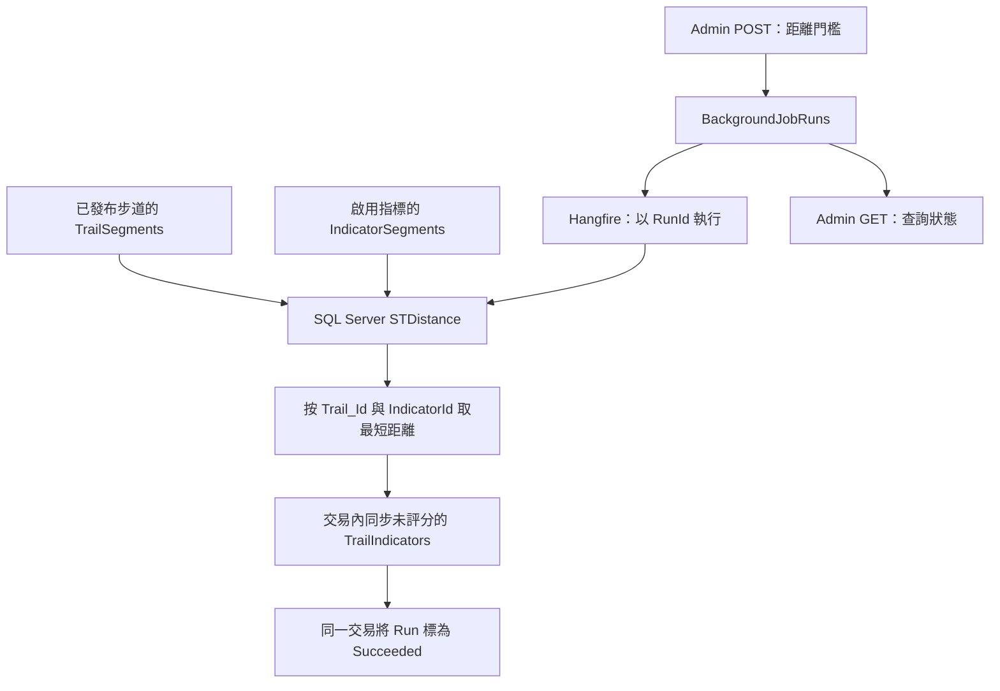

# 空間關聯與 Hangfire 最小異動建議

日期：2026-10-04。文件性質：實作前建議；本次僅新增文件，未修改程式、安裝套件、執行 SQL 或連線驗證實際資料庫。

後續程式實作、啟用設定、API 契約與測試方式見 [空間關聯背景工作 API](SpatialJoins_api.md)。本文件保留設計依據；真實 SQL Server／Hangfire 整合驗證狀態以實際測試結果為準。

## 1. 建議結論與現況依據

依目前架構，建議**只新增一張 `BackgroundJobRuns`，將既有 `TrailIndicators.EvaluatedScore` 改為可空，沿用現有空間資料與關聯**。不需要再建一份 `TrailIndicator`，也不需要為第一版建立 `POIs / TrailPoi`。

第一版由管理員手動要求同步「已發布步道與啟用指標之間、指定距離內的未評分關聯」。已評分資料完整保留，POI 類資料維持 `TrailFeatures` 的單一步道歸屬。因此本功能不是整張 `TrailIndicators` 的全量重建，也不是重新評分。

以下「現況」來自程式與 SQL 快照；「建議」尚未實作。SQL 快照及既有 PMTiles 文件在查閱時為工作目錄中的未追蹤檔案，本次不修改或代為加入版本控制。快照不能代表正式資料庫當前狀態。

| 依據 | 已確認現況與影響 |
| --- | --- |
| [Trail](../Models/Trail.cs)、[TrailSegment](../Models/TrailSegment.cs) | `Trail` 沒有 `Route`；一條步道可有多筆 `TrailSegments.Shape` |
| [Indicator](../Models/Indicator.cs)、[IndicatorSegment](../Models/IndicatorSegment.cs) | `Indicator` 沒有 `Location`；空間資料在多筆 `IndicatorSegments.Shape`，不能一律當成點 |
| [TrailIndicator](../Models/TrailIndicator.cs)、[DbContext](../Models/GoHikeDataContext.cs) | 已有 `TrailIndicators`，複合主鍵為 `(TrailId, IndicatorId)`；SQL 步道欄位名稱是 `Trail_Id` |
| [TrailFeature](../Models/TrailFeature.cs)、[特徵 API](../APIControllers/GoHikeSafe/TrailFeaturesApiController.cs) | `TrailFeatures` 已有 `Location` 與必填 `TrailId`，回報時指定步道；新回報／更新只接受 Point，歷史讀取可保留其他圖形 |
| [SQL 快照](../DatabaseScripts/20260930_dbsnapshot_gohikesave.sql) | 兩種 Segment 的 `Shape`、TrailFeatures 的 `Location` 是 `sys.geography`；僅由型別不能證明每筆 SRID 都是 4326 |
| [步道 API](../APIControllers/GoHikeSafe/TrailsApiController.cs)、[指標 API](../APIControllers/GoHikeSafe/IndicatorApiController.cs) | 公開查詢分別依 `IsPublished`、`IsActive`；已有 JWT 與 Admin 角色使用方式 |
| [Program.cs](../Program.cs)、[專案檔](../prjGoHike.csproj) | 已有 DI、EF Core SQL Server、NetTopologySuite，未整合 Hangfire；DbContext 的 `OnConfiguring` 已啟用 `UseNetTopologySuite()` |

與原稿的調整如下：

| 原稿 | 本專案第一版建議 |
| --- | --- |
| `Trails.Route` 對 `Indicators.Location` | `TrailSegments.Shape` 對 `IndicatorSegments.Shape`，彙總每組步道／指標的最短距離 |
| 新增 `TrailIndicator` | 沿用 `TrailIndicators` 及其複合主鍵、外鍵 |
| 新增 `POIs / TrailPoi` | 沿用 `TrailFeatures`，不改歸屬、不新增多對多表 |
| `DistanceMeters float` | SQL 距離計算仍使用原始結果；儲存沿用 `decimal(12,2)` |
| `CreatedAt` 關聯欄位 | 不另新增；明確界定既有 `EvaluatedAt` 的使用方式 |
| `DELETE` 全表後重建 | 只同步 `EvaluatedScore IS NULL` 的關聯，保護所有已評分資料 |
| `BackgroundJob` | 建議命名 `BackgroundJobRun`／`BackgroundJobRuns`，避免與 Hangfire 的 `BackgroundJob` 類別混淆 |

相關的 [Hangfire 與 MSSQL → PMTiles 規劃](Hangfire_PMtiles_導入規劃.md) 是另一項產圖功能。本文件只處理空間關聯，不導入其版本發布、產檔或外部程序機制；未來共用 Hangfire 註冊時，再整合共同設定。

## 2. 最小資料表與 Model 異動

### 2.1 沿用 TrailIndicators

| 欄位 | 目前型別 | 第一版寫入／保留規則 |
| --- | --- | --- |
| `Trail_Id`, `IndicatorId` | `bigint`，複合主鍵 | 保留；一組步道／指標最多一列 |
| `DistanceMeters` | `decimal(12,2) NULL` | 未評分列存各 Segment 配對的最短距離，單位公尺 |
| `IndicatorWeightSnapshot` | `decimal(6,3) NOT NULL` | 未評分列取當次 `Indicators.Weight`，由伺服器決定 |
| `OverlapRatio` | `decimal(7,6) NULL` | 未評分列為 NULL；距離為零不代表已求得重疊比例 |
| `RawScore` | `decimal(10,4) NULL` | 未評分列為 NULL，不臆造公式 |
| `EvaluatedScore` | `decimal(10,4) NOT NULL` | **唯一建議修改的既有欄位：改為 NULL**，Model 改為 `decimal?` |
| `EvaluatedAt` | `datetime2(0) NOT NULL` | 本 Job 寫未評分列時，明確寫入此次關聯運算 UTC 時間；已評分列保留原值 |

未來部署的 DDL 重點如下；這是文件範例，本次不執行：

```sql
ALTER TABLE dbo.TrailIndicators
ALTER COLUMN EvaluatedScore decimal(10,4) NULL;
```

既有數值包含 `0` 都視為已評分，不把它們轉成 NULL。`NULL` 代表未知，不等於零風險；未來讀取或統計評分時，不可用 `COALESCE(EvaluatedScore, 0)` 消除這個差異。

`EvaluatedAt` 對本 Job 建立的未評分資料表示「關聯運算時間」，不能單憑它推論已完成評分。現有預設值是 `sysdatetime()`，既有時間沒有時區資訊；不宣稱歷史資料都是 UTC，也不在本次建議中批次轉換。Job 必須顯式使用 `SYSUTCDATETIME()`。若後續需要分別記錄距離與評分時間，再拆欄位。

所有 `EvaluatedScore IS NOT NULL` 的列完全不動，即使距離門檻縮小、步道下架或指標停用，也不由此 Job 刪除、更新距離或清空分數。它們是歷史評估，可能已過時，不保證符合本次門檻。公開使用仍須檢查來源發布／啟用狀態，也不能將整張表當成本次精確搜尋結果。

第一版約定 NULL 分數列是此空間同步功能管理的候選資料；目前欄位必填，因此變更欄位本身不會產生這類歷史列。未來若有手動建立未評分關聯的入口，必須先另定來源／保留規則，不能直接與 Job 共用 NULL 語意。

### 2.2 TrailFeatures 維持原樣

保留 `TrailFeatures.Trail_Id` 與 Location，延續 [現有特徵 API 契約](TrailFeatures_api.md)。不建立 `TrailPoi`、不將距離最近的步道自動覆寫為歸屬步道，也不讓 Job 更改 `IsAvailable` 或可信度。

若日後要顯示「距離所屬步道多少公尺」，以 `TrailFeatures.Trail_Id = TrailSegments.Trail_Id` 查詢 `MIN(Location.STDistance(Shape))` 即可，仍需驗證空間資料；本版不新增距離欄位或改動 DTO。多條步道共用同一 POI 屬於不同資料模型需求，延後處理。

### 2.3 新增 BackgroundJobRuns

僅儲存本次請求與使用者可理解的狀態，不複製 Hangfire 的 queue、state history 等內部結構。

| 欄位 | 建議 SQL 型別 | 用途 |
| --- | --- | --- |
| `Id` | `bigint IDENTITY`，PK | 業務執行紀錄 ID，亦即 RunId |
| `JobType` | `varchar(50) NOT NULL` | 第一版固定 `SpatialJoin`，不是由前端自由指定 |
| `Status` | `varchar(20) NOT NULL` | Pending、Queued、Processing、RetryPending、Succeeded、Failed |
| `HangfireJobId` | `varchar(100) NULL` | 被選定執行此 Run 的 Hangfire 工作 ID，不建跨 schema 外鍵 |
| `DistanceMeters` | `decimal(12,2) NOT NULL` | 本 Run 不可變的距離門檻；不是每列關聯的實測距離 |
| `CreatedAt` | `datetime2(0) NOT NULL` | UTC，預設 `SYSUTCDATETIME()` |
| `StartedAt` | `datetime2(0) NULL` | UTC，第一次開始時間，重試不覆寫 |
| `FinishedAt` | `datetime2(0) NULL` | UTC，只在最終成功／失敗填入 |
| `ErrorMessage` | `nvarchar(500) NULL` | 受控且可顯示的錯誤摘要；完整例外僅寫伺服器日誌 |

建議加上狀態與距離範圍的 CHECK，以及 `(JobType, Status, CreatedAt)` 查詢索引。門檻初始建議為 `0.01～10000.00` 公尺、最多兩位小數；API、Job 與資料庫一致驗證，不讓轉型默默截斷小數。100 公尺是文件示例值，不是既有業務規則。

沿用 DI 管理的 DbContext，新增 DbSet 與映射即可。若採 DB-first，更新資料庫後只同步相關 Model／映射，不把工作邏輯寫進反向工程檔案。既有公開步道／指標 DTO 不因這張表而改動。

本表不建立結果明細歷史，也不新增每列關聯的 RunId。它能說明一次工作的門檻與狀態，**不能單憑 Run 紀錄還原歷史結果，或證明已評分列使用相同門檻**。

### 2.4 Schema 異動腳本與部署檢查

依上述規劃新增 [20261004_add_spatial_join_job_runs.sql](../DatabaseScripts/20261004_add_spatial_join_job_runs.sql)，以 20260930 快照為基底進行增量異動；原始快照保留。本腳本尚未在 SQL Server 執行驗證。

腳本在單一交易內將 `TrailIndicators.EvaluatedScore` 改為可空、建立 `BackgroundJobRuns`，以及第 2.3 節的主鍵、UTC 建立時間預設值、狀態／距離 CHECK 與查詢索引。它不回填、清空或重算任何業務資料；不包含第 3 節的 Job 同步 SQL。JobType、Status 由應用程式明確寫入，第一版建立請求時分別填 `SpatialJoin`、`Pending`。

可在相同腳本建立的 schema 上重複執行；已可空的評分欄位、既有表與同名索引會跳過建立。遇到評分型別或工作表必要欄位不符時，停止並回滾。這不是通用 schema 修復工具：既有同名物件的 CHECK、主鍵、預設值與索引若曾被人工修改，部署前須比對並另行處理，不會自動刪除重建。

部署與驗收順序：

1. 選定目標資料庫並確認 `DB_NAME()`；在測試資料庫還原基底 schema，保留代表性的非零及零分資料作前後比對。
2. 以獨立批次、無外層交易執行腳本；確認 EvaluatedScore 仍為 `decimal(10,4)` 且允許 NULL，既有評分、距離、權重、時間、主鍵及外鍵均保留。
3. 確認 BackgroundJobRuns 的九個欄位、`Id` identity 主鍵、`SYSUTCDATETIME()` 預設值、兩個 CHECK，以及 `(JobType, Status, CreatedAt)` 索引；再次執行不新增重複物件、不改動資料。
4. 在測試交易中驗證六種狀態都可寫入、非法狀態被拒絕；距離 `0.01`、`10000.00` 可寫入，`0`、`10000.01` 與 NULL 被拒絕；省略 CreatedAt 時填入 UTC。測試完回滾資料。
5. 驗證 schema 不符時腳本停止，且同一交易內較早完成的異動回滾；同名表已存在的分支也須測試。
6. 更新 EF Model 與讀取端以支援 nullable 分數，並完成 BackgroundJobRun 映射，再依第 6 節接入及啟用 Job。

`decimal(12,2)` 與範圍 CHECK 只能保護儲存後的值；SQL Server 轉入較小 scale 時可能先四捨五入，因此它們不能拒絕所有「原始請求超過兩位小數」的情況。API／Service 必須在建立 SQL 參數前驗證原始 decimal，不能靠 CHECK 補回已失去的精度。參考 [Microsoft decimal／numeric 轉換規則](https://learn.microsoft.com/en-us/sql/t-sql/data-types/decimal-and-numeric-transact-sql?view=sql-server-ver17)。

## 3. 距離計算、驗證與同步範例

### 3.1 計算規則



第一版選取 `Trails.IsPublished = 1` 與 `Indicators.IsActive = 1`。指標可以是點、線或面，求的是兩個圖形間最短距離；相交時為零，不能據此推算重疊比例、步行距離或風險分數。

SQL Server `STDistance` 回傳 float，單位依 SRID，兩者 SRID 不同或圖形為空時可回傳 NULL；本功能固定驗證 WGS84／4326，再以公尺使用。參考 [Microsoft STDistance 文件](https://learn.microsoft.com/en-us/sql/t-sql/spatial-geography/stdistance-geography-data-type?view=sql-server-ver17)。不要將資料拉回 .NET 後，用經緯度的平面距離取代 SQL geography 運算。

來源驗證原則：

- 已發布步道或啟用指標若完全沒有 Segment，視為資料不完整，整批失敗並保留原結果。
- 入選的每筆 Shape 都必須非 NULL、有效、非空、SRID 4326；步道限 LineString／MultiLineString，指標採現有 API 支援的點／線／面及其 Multi 型別。
- 不以 `WHERE Shape.STSrid = 4326` 靜默跳過無效資料，再把對應舊關聯刪掉；先驗證整個入選來源才開始同步。
- 來源驗證通過但沒有任何配對在距離內，是合法空結果。沒有已發布步道或沒有啟用指標，也可合法為空；此時刪除所有未評分候選，已評分列仍保留。
- 沒有匹配的未評分列，包含來源下架／停用者，於本次同步移除。這與「已發布／啟用，但缺少 Segment」導致整批失敗不同。

### 3.2 參數化 SQL 核心範例

以下是**Job 的交易內核心片段，不是可單獨執行的部署腳本**。呼叫端須先按第 4 節取得執行權、檢查 Run／HangfireJobId，並在同一 SQL 連線的 `Serializable` 交易取得 `GoHike:SpatialJoin` 排他應用程式鎖。`@RunId`、`@DistanceMeters` 由伺服器讀取 Run 後，以具型別的 SQL 參數傳入；不得拼接前端字串。執行前須已完成第 2 節 schema／Model 變更。

來源讀取、驗證、同步及成功紀錄全部在該交易中；Serializable 是此小規模版本的明確選擇，讓來源變更受到交易鎖保護，不假設資料庫已啟用 SNAPSHOT。交易會阻擋部分管理寫入，須設定 timeout 並量測；重試採用重試當下的來源，不承諾重播第一次嘗試的資料快照。

```sql
-- 由呼叫端提供：@RunId bigint、@DistanceMeters decimal(12,2)。
-- 已在 Serializable 交易內取得應用程式鎖，且再次確認此 Run 可以執行。
-- 若 Run 已 Succeeded／Failed，或目前 Hangfire 工作不是該 Run 的執行者，
-- 呼叫端直接結束，不進入本片段。失敗一律 rollback，再處理工作狀態。
SET XACT_ABORT ON;

IF @DistanceMeters IS NULL OR @DistanceMeters < 0.01 OR @DistanceMeters > 10000.00
    THROW 51000, 'Invalid spatial distance threshold.', 1;

IF EXISTS (
    SELECT 1 FROM dbo.Trails AS t
    WHERE t.IsPublished = 1
      AND NOT EXISTS (SELECT 1 FROM dbo.TrailSegments AS s WHERE s.Trail_Id = t.Trail_Id)
) OR EXISTS (
    SELECT 1 FROM dbo.Indicators AS i
    WHERE i.IsActive = 1
      AND NOT EXISTS (SELECT 1 FROM dbo.IndicatorSegments AS s WHERE s.IndicatorId = i.IndicatorId)
)
    THROW 51001, 'Active spatial source has no segments.', 1;

SELECT s.Trail_Id, s.Shape
INTO #TrailSource
FROM dbo.TrailSegments AS s
JOIN dbo.Trails AS t ON t.Trail_Id = s.Trail_Id
WHERE t.IsPublished = 1;

SELECT s.IndicatorId, s.Shape, i.Weight
INTO #IndicatorSource
FROM dbo.IndicatorSegments AS s
JOIN dbo.Indicators AS i ON i.IndicatorId = s.IndicatorId
WHERE i.IsActive = 1;

IF EXISTS (
    SELECT 1 FROM #TrailSource
    WHERE Shape IS NULL OR Shape.STSrid <> 4326
       OR Shape.STIsValid() = 0 OR Shape.STIsEmpty() = 1
       OR Shape.STGeometryType() NOT IN ('LineString', 'MultiLineString')
) OR EXISTS (
    SELECT 1 FROM #IndicatorSource
    WHERE Shape IS NULL OR Shape.STSrid <> 4326
       OR Shape.STIsValid() = 0 OR Shape.STIsEmpty() = 1
       OR Shape.STGeometryType() NOT IN
          ('Point', 'MultiPoint', 'LineString', 'MultiLineString', 'Polygon', 'MultiPolygon')
)
    THROW 51002, 'Invalid spatial source.', 1;

-- 一個主表配對可能有很多 Segment 配對，必須先彙總。
SELECT t.Trail_Id, i.IndicatorId,
       MIN(d.Meters) AS MinDistanceMeters,
       MAX(i.Weight) AS IndicatorWeightSnapshot,
       COUNT_BIG(*) - COUNT_BIG(d.Meters) AS NullDistanceCount
INTO #PairDistances
FROM #TrailSource AS t
CROSS JOIN #IndicatorSource AS i
CROSS APPLY (VALUES (i.Shape.STDistance(t.Shape))) AS d(Meters)
GROUP BY t.Trail_Id, i.IndicatorId;

IF EXISTS (SELECT 1 FROM #PairDistances WHERE NullDistanceCount > 0)
    THROW 51003, 'Unexpected null spatial distance.', 1;

SELECT Trail_Id, IndicatorId,
       CAST(MinDistanceMeters AS decimal(12,2)) AS DistanceMeters,
       IndicatorWeightSnapshot
INTO #Candidates
FROM #PairDistances
WHERE MinDistanceMeters <= @DistanceMeters; -- 先比較原始值，再轉 decimal。

CREATE UNIQUE CLUSTERED INDEX IX_Candidates
ON #Candidates(Trail_Id, IndicatorId);

DECLARE @EvaluatedAt datetime2(0) = SYSUTCDATETIME();

UPDATE target
SET DistanceMeters = candidate.DistanceMeters,
    IndicatorWeightSnapshot = candidate.IndicatorWeightSnapshot,
    OverlapRatio = NULL,
    RawScore = NULL,
    EvaluatedAt = @EvaluatedAt
FROM dbo.TrailIndicators AS target
JOIN #Candidates AS candidate
  ON candidate.Trail_Id = target.Trail_Id
 AND candidate.IndicatorId = target.IndicatorId
WHERE target.EvaluatedScore IS NULL;

INSERT INTO dbo.TrailIndicators
    (Trail_Id, IndicatorId, DistanceMeters, IndicatorWeightSnapshot,
     OverlapRatio, RawScore, EvaluatedScore, EvaluatedAt)
SELECT candidate.Trail_Id, candidate.IndicatorId,
       candidate.DistanceMeters, candidate.IndicatorWeightSnapshot,
       NULL, NULL, NULL, @EvaluatedAt
FROM #Candidates AS candidate
WHERE NOT EXISTS (
    SELECT 1 FROM dbo.TrailIndicators AS target
    WHERE target.Trail_Id = candidate.Trail_Id
      AND target.IndicatorId = candidate.IndicatorId
);

DELETE target
FROM dbo.TrailIndicators AS target
WHERE target.EvaluatedScore IS NULL
  AND NOT EXISTS (
      SELECT 1 FROM #Candidates AS candidate
      WHERE candidate.Trail_Id = target.Trail_Id
        AND candidate.IndicatorId = target.IndicatorId
  );

UPDATE dbo.BackgroundJobRuns
SET Status = 'Succeeded', FinishedAt = SYSUTCDATETIME(), ErrorMessage = NULL
WHERE Id = @RunId AND JobType = 'SpatialJoin' AND Status = 'Processing'
  AND DistanceMeters = @DistanceMeters;

IF @@ROWCOUNT <> 1
    THROW 51004, 'Spatial run state changed.', 1;

DROP TABLE #Candidates;
DROP TABLE #PairDistances;
DROP TABLE #IndicatorSource;
DROP TABLE #TrailSource;
-- 呼叫端 commit；上述任一步驟失敗時，呼叫端 rollback 全部資料與成功狀態。
```

本例採暫存來源、全配對與分組，目的是讓第一版規則容易驗證，不宣稱已完成空間查詢最佳化。CROSS APPLY 是查詢表達方式，不保證 SQL Server 實體執行時只計算一次距離。資料量增加時須看執行計畫，再評估直接利用原表空間索引縮小候選範圍；不能預設暫存表版本會使用原表 spatial index。

同一 Run 成功後再被執行會跳過，不再改動時間；新 Run 重新運算則可更新未評分列的時間及權重。唯一鍵只能避免重複列，不能單獨確保整批同步及工作狀態一致。

## 4. 工作生命週期、互斥與恢復

### 4.1 責任分工與 API 契約

採現有的 Controller → Service／Job → DbContext／參數化 SQL 結構。Controller 負責驗證與 HTTP 回應，`SpatialJoinService` 處理建立 Run、排入及補排，`SpatialJoinJob` 執行同步；不建立通用 Repository、CQRS 或額外架構層。Hangfire 註冊集中於 `Program.cs`，業務類別由 DI 建立。

| API 建議 | 請求／回應 |
| --- | --- |
| `POST /api/admin/spatial-joins` | Admin；Request DTO 只接受 `distanceMeters`，例如 `{"distanceMeters":100}` |
| `GET /api/admin/spatial-joins/{id}` | Admin；查詢 Run 的狀態、門檻、UTC 時間與受控錯誤摘要 |

建立成功用 `AcceptedAtAction` 包裝 `ApiResponse<SpatialJoinRunResponse>`，回 `202 Accepted` 和 `Location`，不要使用既有回 201 的 `CreatedResponse`。回應範例如下；實際 Status 可以已進入 Queued：

```json
{
  "success": true,
  "message": "已接受空間關聯同步請求。",
  "data": {
    "id": 12,
    "status": "Pending",
    "distanceMeters": 100.00,
    "statusUrl": "/api/admin/spatial-joins/12"
  }
}
```

門檻必填、在核准範圍內且最多兩位小數，無效回 400；未登入 401、非 Admin 403、不存在 ID 404；已有非終止 SpatialJoin 時 POST 回 409，並回該 Run 的查詢網址。無法持久化請求回 503。只有 Run 已存妥、補排機制已啟用時，Hangfire 暫時不可用仍可回 202／Pending；202 不表示空間資料已更新。

Job 的唯一**業務參數**是 RunId；執行時讀取資料庫門檻，不再同時序列化另一份 distanceMeters。CancellationToken 由背景工作提供，不延用已結束 HTTP request 的 token；取得目前 Hangfire Job ID 可使用其執行上下文，這是基礎設施資訊，不由前端指定。

Angular 只讀上述 API，不直接讀 `HangFire.*`。HangfireJobId 留給後端診斷，不必在前端 DTO 暴露；API 不回傳原始例外、SQL 或堆疊。

### 4.2 狀態定義

```text
Pending → Queued → Processing → Succeeded
                       ↓
                  RetryPending → Queued / Processing
                       ↓
                     Failed（重試耗盡或已終止）
```

Pending 表示請求已持久化、尚未確認入列；Queued 表示已有選定的 Hangfire 工作；Processing 表示正在執行；RetryPending 表示本次嘗試失敗但仍等待重試。StartedAt 只記第一次開始；RetryPending 的 FinishedAt 仍為 NULL，Succeeded／Failed 才填入。

建議本工作明確設定 `AutomaticRetry(Attempts = 3)`，使用 Hangfire 該版本的遞增延遲，不另外在 Job 內建立重試迴圈。驗證錯誤即使進入有限次重試，也不得改動關聯；第一版不另建錯誤分類框架。

Job catch 應回滾並記錄、上拋例外；不能 catch 後正常返回，也不能立即寫成最終 Failed。透過套用後的 Hangfire 狀態通知及補排／校對工作，將實際重試排程映射成 RetryPending，最終 Failed 才寫結束時間。通知處理失敗由校對恢復；不能把 Hangfire 每次嘗試產生的失敗候選狀態當成終態。參考 [Hangfire 例外與重試](https://docs.hangfire.io/en/latest/background-processing/dealing-with-exceptions.html)。

### 4.3 同一時間只接受一個非終止 Run

不同門檻不排成多筆等待互相覆寫的工作。建立 Run 時，在短交易內取得固定資源名 `GoHike:SpatialJoin` 的 SQL `sp_getapplock` 排他鎖，檢查是否有 Pending／Queued／Processing／RetryPending，再建立 Pending 並提交；已有工作則回 409。所有 Web 實例須使用相同資料庫、principal 與資源名。

Job 每次嘗試在主交易取得相同鎖，取得後重查 Run 及執行者，再讀取／驗證來源、同步結果並更新 Succeeded，一次提交。取得鎖失敗不得繼續；使用 `LockOwner = Transaction`、有限 timeout 並檢查回傳值，交易結束才釋放鎖。API 取得鎖逾時且確認有活動 Run 可回 409，其他儲存失敗回 503。應用程式鎖的行為見 [Microsoft sp_getapplock 文件](https://learn.microsoft.com/en-us/sql/relational-databases/system-stored-procedures/sp-getapplock-transact-sql?view=sql-server-ver17)。

Processing／StartedAt 可先用短交易持久化，讓查詢可看見執行狀態；正式同步交易取得鎖後仍須重查。Processing 不是不可重入的旗標：程序中斷後，原 Hangfire 工作恢復執行時可再次進入，真正的執行互斥由交易鎖提供。GET 僅讀 Run，不讀結果表，也不參與排入；狀態更新期間可能等待資料列鎖，需設定合理查詢 timeout。

WorkerCount 可先設 1 限制負載，但不能代替資料庫互斥。`DisableConcurrentExecution` 也不提供單獨的正確性保證；本方案不需要付費節流套件。參考 [Hangfire 並行限制](https://docs.hangfire.io/en/latest/background-processing/throttling.html)。未來若增加評分寫入，也須遵守同一互斥／交易規則，防止一邊評分、一邊同步候選資料。

### 4.4 入列中斷與狀態校對

Run 與 Hangfire 儲存不假設能跨兩個寫入自動原子提交。建議啟用固定 ID、每分鐘一次的補排／校對工作，只處理 SpatialJoin；它使用現有 Run 表，不另建 outbox 表。

1. API 先提交 Pending，接著嘗試 `Enqueue(RunId)`，以條件更新保存 HangfireJobId。排入程式不可把已進入 Processing／Succeeded 的狀態退回 Queued。
2. Pending 超過 60 秒且沒有已綁定 Job ID，掃描器再次嘗試排入。失敗仍保持 Pending 並記錄告警；服務恢復後接續，不清掉請求。
3. 入列成功、Job ID 尚未回存就中斷，可能產生多個攜帶同一 RunId 的 Hangfire 工作。API 回存／Worker 開始時，在短交易取得同一應用程式鎖，使用「只在 HangfireJobId 為 NULL 時寫入」選定一個執行者。Worker 可先綁定自己的 ID；之後不同 ID 的重複工作直接結束，不寫業務狀態。所有更新須核對目前綁定 ID，避免失敗回呼來自被捨棄的重複工作。
4. 掃描器透過 Hangfire 公開儲存／監控 API 查詢已綁定工作的**目前**狀態，再校對 Queued／Processing／RetryPending／Failed；不直接查其 SQL tables。更新時重查 Run 的 ID、綁定 Job ID 及可轉移狀態，且不覆寫 Succeeded／Failed。延遲的狀態通知不得使用舊事件直接倒退狀態。
5. 已綁定工作若確認被刪除或不存在，以同一鎖重新確認後將 Run 終止為 Failed，錯誤摘要指示重新提出請求；Hangfire 暫時不可連線不等於工作不存在，不據此清除綁定。查詢時與外部狀態仍可能競態，因此 Worker 在同步交易內核對終態與綁定 ID 是最後保護。
6. SQL 提交前中斷：結果與 Succeeded 一起回滾，Hangfire 復原／重試後重新執行。SQL 提交後、Hangfire 尚未確認完成就中斷：再次執行先看到 Succeeded，直接返回。
7. Failed 為業務終態；修正問題後以新的 POST 建立 Run。不得由 Hangfire Dashboard 重試舊 Failed Run 來覆寫新門檻；即使誤按，Job 的終態檢查也使其不執行。

同一 Job ID 仍可能同時有兩個嘗試，兩者均須通過主交易鎖；第一個成功後，第二個取得鎖看到 Succeeded 即結束。短交易更新 Processing、狀態校對與終態更新也遵守同一鎖及條件檢查，不能在另一個執行已成功後寫回失敗。

上述恢復依賴 Web／Hangfire Server 常駐、補排工作持續執行及儲存最終恢復可用。至少監控最久 Pending 時間、長時間 Processing／RetryPending、最後成功時間、失敗次數與鎖逾時；使用 RunId／HangfireJobId 串接日誌。停機取消交由 Hangfire 復原，不直接視為業務最終失敗。

## 5. 部署前唯讀盤點

以下查詢供未來在目標 SQL Server 執行；本次沒有執行。資料量與 SRID 都必須以實際環境為準。

```sql
SELECT 'Trails' AS TableName, COUNT_BIG(*) AS [RowCount] FROM dbo.Trails
UNION ALL SELECT 'Indicators', COUNT_BIG(*) FROM dbo.Indicators
UNION ALL SELECT 'TrailSegments', COUNT_BIG(*) FROM dbo.TrailSegments
UNION ALL SELECT 'IndicatorSegments', COUNT_BIG(*) FROM dbo.IndicatorSegments
UNION ALL SELECT 'TrailFeatures', COUNT_BIG(*) FROM dbo.TrailFeatures
UNION ALL SELECT 'TrailIndicators', COUNT_BIG(*) FROM dbo.TrailIndicators;

SELECT 'TrailSegments' AS SourceName, Shape.STSrid AS Srid, COUNT_BIG(*) AS [RowCount]
FROM dbo.TrailSegments GROUP BY Shape.STSrid
UNION ALL
SELECT 'IndicatorSegments', Shape.STSrid, COUNT_BIG(*)
FROM dbo.IndicatorSegments GROUP BY Shape.STSrid
UNION ALL
SELECT 'TrailFeatures', Location.STSrid, COUNT_BIG(*)
FROM dbo.TrailFeatures GROUP BY Location.STSrid;

SELECT 'TrailSegments' AS SourceName, TrailSegment_Id AS SegmentId
FROM dbo.TrailSegments
WHERE Shape IS NULL OR Shape.STSrid <> 4326 OR Shape.STIsValid() = 0 OR Shape.STIsEmpty() = 1
UNION ALL
SELECT 'IndicatorSegments', IndicatorSegmentId
FROM dbo.IndicatorSegments
WHERE Shape IS NULL OR Shape.STSrid <> 4326 OR Shape.STIsValid() = 0 OR Shape.STIsEmpty() = 1
UNION ALL
SELECT 'TrailFeatures', FeatureId
FROM dbo.TrailFeatures
WHERE Location IS NULL OR Location.STSrid <> 4326 OR Location.STIsValid() = 0 OR Location.STIsEmpty() = 1;

SELECT SCHEMA_NAME(t.schema_id) AS SchemaName, t.name AS TableName,
       c.name AS ColumnName, TYPE_NAME(c.user_type_id) AS SqlType
FROM sys.tables AS t
JOIN sys.columns AS c ON c.object_id = t.object_id
WHERE t.schema_id = SCHEMA_ID('dbo')
  AND ((t.name IN ('TrailSegments', 'IndicatorSegments') AND c.name = 'Shape')
    OR (t.name = 'TrailFeatures' AND c.name = 'Location'));

SELECT SCHEMA_NAME(t.schema_id) AS SchemaName, t.name AS TableName,
       si.name AS IndexName, c.name AS ColumnName, si.is_disabled
FROM sys.spatial_indexes AS si
JOIN sys.tables AS t ON t.object_id = si.object_id
JOIN sys.index_columns AS ic ON ic.object_id = si.object_id AND ic.index_id = si.index_id
JOIN sys.columns AS c ON c.object_id = ic.object_id AND c.column_id = ic.column_id
WHERE t.schema_id = SCHEMA_ID('dbo')
  AND t.name IN ('TrailSegments', 'IndicatorSegments', 'TrailFeatures');
```

再檢查已發布／啟用但沒有 Segment 的主表筆數，以及第一版允許的幾何型別；可將第 3 節驗證的 EXISTS 改為 SELECT 主鍵做唯讀清單。不要在盤點時自動 `MakeValid()`、改 SRID 或清除資料。

DbContext 有 `SIX_TrailSegments_Shape`、`SIX_IndicatorSegments_Shape` 的索引映射名稱，但快照未列出對應 CREATE SPATIAL INDEX。這只能表示需要查證，不能推論索引一定存在或一定不存在；使用上方 catalog 查詢確認是否為真正的空間索引及是否停用。

## 6. 實作順序、驗收與限制

未來實作建議順序：盤點並修復來源 → 變更 nullable／建立 Run 表與映射 → 在測試 SQL Server 驗證同步交易 → 接入 Hangfire、補排與 Admin API → 驗證重試／中斷 → 開放管理入口。不把新增 schema 與啟用 Job 當成同一步部署；先確保所有會讀取 EvaluatedScore 的程式能接受 NULL，再讓 Job 產生未評分資料。

若停用功能，先停止接受新 Run、停用補排並等候或停止工作。保留既有評分與 Run 紀錄，不直接還原 EvaluatedScore 為 NOT NULL；新產生的 NULL 列需要另訂資料處置，不能填零強行回復。

| 測試情境 | 驗收結果 |
| --- | --- |
| 同步道／指標各有多個 Segment，最近者不是第一筆 | 只存一列，取所有配對的最短距離 |
| 指標點在線上、線／面與步道相交 | 距離為零；RawScore／OverlapRatio／EvaluatedScore 仍為 NULL |
| 門檻為 100m，原始距離 100.004m | 即使儲存四捨五入會是 100.00，也不納入；等於門檻者納入 |
| SRID 不同、無效／空圖形、已發布主表無 Segment | 整批失敗，原結果不變；受控錯誤可查詢 |
| 來源正常但門檻內零筆，或沒有任何啟用／已發布來源 | 合法空結果，移除未評分候選，已評分列不動 |
| 步道下架、指標停用、門檻縮小 | 不合條件的未評分列移除，已評分列完整保留 |
| 已評分列含 0 分，距離／權重已與來源不同 | 所有欄位保持原值，不當作未評分資料覆寫 |
| 新關聯、既有未評分關聯 | 正確填距離與權重、UTC 運算時間；沒有虛構的分數／比例 |
| 同一 Run 重送、同一 Job ID 兩個執行、新 Run 使用相同門檻 | 無重複鍵；成功 Run 重入不更新時間，新 Run 可重新計算 |
| 任一步驟失敗、交易逾時／死結、程序在提交前中斷 | 資料與成功紀錄全部回滾，重試取得一致的來源重新執行 |
| 提交後但 Hangfire 尚未確認就中斷 | Run 已成功，重跑直接結束，不重寫結果 |
| Pending 建立後中斷、入列成功但回存 ID 前中斷 | 掃描補排；多個 Hangfire 工作中只選定一個執行者 |
| 有其他門檻的活動 Run、舊 Failed 工作被手動重試 | 新 POST 回 409；終止的舊工作不能覆寫後續結果 |
| 一次嘗試失敗、重試成功、重試耗盡、通知處理失敗 | RetryPending 與 Failed 語意正確，校對能恢復狀態，不倒退 Succeeded |
| API／MVC 在同步中修改 Segment 或發布／啟用狀態 | 被交易阻擋或造成可處理的衝突，不產生不同時點資料混合的部分結果 |
| 未登入／一般會員／Admin，無效門檻／不存在 ID | 401／403／可操作，400／404；接受工作回 202 與有效 Location |
| 執行 Job 前後比較 TrailFeatures | 歸屬、Location、審核／可信度與筆數皆未被 Job 修改 |

實作階段先 build，再跑既有集中 API 測試；空間運算、SQL 精度、鎖、交易、斷線與恢復必須另在真實 SQL Server 與 Hangfire SQL 儲存驗證。[現有 GoHikeSafeApiTests](../../tests/GoHikeSafeApiTests/Program.cs) 使用資料庫替身，不能代替這些整合測試。

```bash
dotnet build prjGoHike/prjGoHike.csproj
dotnet run --project tests/GoHikeSafeApiTests
```

以上命令是未來實作驗收建議，本次純文件交付未執行。文件本身檢查 Markdown、相對連結與欄位對照即可，不執行廣泛 E2E。

已確認的第一版邊界：保護既有已評分資料；不制定評分公式；不支援共享 POI；不自動監聽每個 CRUD 觸發空間重算；不做歷史結果還原；不擴大為 PMTiles、通用排程平台或新的架構層。Hangfire 負責執行與重試，SQL Server 負責距離與一致性，現有資料表仍是業務結構的主體。
